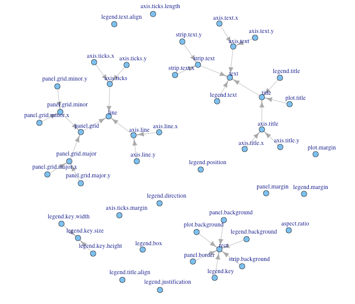

  
```{r}
# Cargamos la librería
library(tidyverse)
```


```{r}
# Cargamos los datos
ggplot2::mpg
```

```{r}
data = ggplot2::mpg
head(data)
```


```{r}
# Creamos un gráfico con ggplot

# Datos
ggplot(data = mpg) +
  # Geometrias (funciones de estética)
  geom_point(mapping = 
               aes(x = displ,
                   y = hwy))
```


Este gráfico solo representa cada una de las observaciones, entre dos variables. Una simple representación de un gráfico de disperción, donde podemos verificar la correlación entre variables.

Sin embargo, podemos mejorar este gráfico, añadiendo parámetros en **ggplot2** para que podamos diferenciar ciertos aspectos de nuestro análisis

```{r}
# Diferenciar por color cada clase de coche
ggplot(data = mpg) +
  geom_point(mapping = aes(x = displ,
                           y = hwy,
                           color = class))
```


```{r}
# Diferenciar por color cada tipo de tracción
ggplot(data = mpg) +
  geom_point(mapping = aes(x = displ,
                           y = hwy,
                           color = trans))
```


```{r}
# Diferenciar por color cada tipo de fuel
ggplot(data = mpg) +
  geom_point(mapping = aes(x = displ,
                           y = hwy,
                           color = fl))
```


```{r}
# Diferenciar por color cada tipo de tracción
ggplot(data = mpg) +
  geom_point(mapping = aes(x = displ,
                           y = hwy,
                           color = cyl))
```


Con este último gráfico podemos interpretar que a más cilindros, tenemos más consumo por displ.


```{r}
# Podemos realizar una diferenciación con el tamaño de cada clase con el atributo size
ggplot(data = mpg) +
  geom_point(
    mapping = aes(
      x = displ,
      y = cty,
      size = class
    )
  )
```


```{r}
# ALPHA es la gradación de color por clase
ggplot(data = mpg) +
  geom_point(
    mapping = aes(
      x = displ,
      y = cty,
      alpha = class
    )
  )
```


```{r}
# SHAPE es el tipo de punto a visualizar, en nuestro caso será Class
ggplot(data = mpg) +
  geom_point(
    mapping = aes(
      x = displ,
      y = cty,
      shape = class
    )
  )
```

```{r}
display.brewer.all(colorblindFriendly = TRUE)      # Show all color palettes
```


```{r}
# Asignamos la escala de colores (por paleta, hexadecimal o combinaciones en ColorBrewer)
ggplot(data = mpg) +
  geom_point(mapping = aes(
    x = displ, 
    y = hwy), 
    color = "#9999CC")

```


# Indicar las paletas de colores de RColorBrewer 
https://ggplot2.tidyverse.org/reference/scale_brewer.html#palettes

```{r}
ggplot(data = mpg) +
  geom_point(mapping = aes(
    x = displ, 
    y = hwy), 
    color = "#FF00FF")
```


```{r}
# creamos una matriz con facet_wrap para distribuir las variables o elementos
ggplot(data = mpg) +
  geom_point(
    mapping = aes(
      x = displ,
      y = hwy
    ),
    color = "#999988"
  ) +
  facet_wrap(~ class, nrow = 3)
```


```{r}
# creamos una matriz con todos los atributos excepto ~ class
ggplot(data = mpg) + 
  geom_point(
    mapping = aes(
      x = displ,
      y = hwy
      
    ), color = "#556666"
  ) +
  facet_wrap(drv ~ cyl)
```


## Observamos el resto de elementos visuales

```{r}
# Visualización por puntos
ggplot(data = mpg) +
  geom_point(mapping = aes(
    x = year,
    y = displ
  ))
```


```{r}
# Visualización por área marcando la distribución de cada atributo
ggplot(data = mpg) +
  geom_smooth(mapping = aes(
    x = displ,
    y = cty,
    linetype = drv
  ))
```


```{r}
# Visualización por área aplicando el método loess
ggplot(data = mpg) +
  geom_smooth(mapping = aes(
    x = displ,
    y = cty
  ), method = 'loess')
```


```{r}
# Visualización por área aplicando el método lm
ggplot(data = mpg) +
  geom_smooth(mapping = aes(
    x = displ,
    y = cty
  ), method = 'lm')
```


```{r}
# Visualización por área aplicando el método lm
ggplot(data = mpg) +
  geom_smooth(mapping = aes(
    x = displ,
    y = cty
  ), method = 'gam')
```


```{r}
# Visualización por área aplicando el método lm
ggplot(data = mpg) +
  geom_smooth(mapping = aes(
    x = displ,
    y = cty
  ),
  method = 'gam',
  show.legend = TRUE
  )
```


```{r}
ggplot(data = mpg) +
  geom_boxplot(mapping = aes(
    x = displ,
    y = cty
  ),
  show.legend = TRUE,
  color = '#FF00FF'
  )
```

## Personalización de nuestros elementos gráficos y tema


```{r}
p1 <- ggplot(mtcars, aes(wt, mpg)) +
  geom_point() +
  labs(title = "Fuel economy declines as weight increases")
p1
```

```{r}
# Plot ---------------------------------------------------------------------
p1 + theme(plot.title = element_text(size = rel(2)))
p1 + theme(plot.background = element_rect(fill = "green"))
```

```{r}
# Panels --------------------------------------------------------------------

p1 + theme(panel.background = element_rect(fill = "white", colour = "grey50"))
p1 + theme(panel.border = element_rect(linetype = "dashed", fill = NA))
p1 + theme(panel.grid.major = element_line(colour = "black"))
p1 + theme(
  panel.grid.major.y = element_blank(),
  panel.grid.minor.y = element_blank()
)
```


```{r}
# Put gridlines on top of data
p1 + theme(
  panel.background = element_rect(fill = NA),
  panel.grid.major = element_line(colour = "grey50"),
  panel.ontop = TRUE
)
```


```{r}
# Axes ----------------------------------------------------------------------
# Change styles of axes texts and lines
p1 + theme(axis.line = element_line(size = 3, colour = "grey80"))
p1 + theme(axis.text = element_text(colour = "blue"))
p1 + theme(axis.ticks = element_line(size = 2))
```


```{r}
# Change the appearance of the y-axis title
p1 + theme(axis.title.y = element_text(size = rel(1.5), angle = 90))
```

```{r}
# Make ticks point outwards on y-axis and inwards on x-axis
p1 + theme(
  axis.ticks.length.y = unit(.25, "cm"),
  axis.ticks.length.x = unit(-.25, "cm"),
  axis.text.x = element_text(margin = margin(t = .3, unit = "cm"))
)
```

```{r}
# Legend --------------------------------------------------------------------
p2 <- ggplot(mtcars, aes(wt, mpg)) +
  geom_point(aes(colour = factor(cyl), shape = factor(vs))) +
  labs(
    x = "Weight (1000 lbs)",
    y = "Fuel economy (mpg)",
    colour = "Cylinders",
    shape = "Transmission"
   )
p2
```

```{r}
# Posición de la leyenda
p2 + theme(legend.position = "none")
p2 + theme(legend.justification = "top")
p2 + theme(legend.position = "bottom")
```

```{r}
# Or place legends inside the plot using relative coordinates between 0 and 1
# legend.justification sets the corner that the position refers to
p2 + theme(
  legend.position = c(.95, .95),
  legend.justification = c("right", "top"),
  legend.box.just = "right",
  legend.margin = margin(6, 6, 6, 6)
)
```

```{r}
# The legend.box properties work similarly for the space around
# all the legends
p2 + theme(
  legend.box.background = element_rect(),
  legend.box.margin = margin(6, 6, 6, 6)
)
```

```{r}
# You can also control the display of the keys
# and the justification related to the plot area can be set
p2 + theme(legend.key = element_rect(fill = "white", colour = "black"))
p2 + theme(legend.text = element_text(size = 8, colour = "red"))
p2 + theme(legend.title = element_text(face = "bold"))
```


```{r}
# Strips --------------------------------------------------------------------

p3 <- ggplot(mtcars, aes(wt, mpg)) +
  geom_point() +
  facet_wrap(~ cyl)
p3
```

```{r}
p3 + theme(strip.background = element_rect(colour = "black", fill = "white"))
p3 + theme(strip.text.x = element_text(colour = "white", face = "bold"))
p3 + theme(panel.spacing = unit(1, "lines"))
```


```{r}
# modificación del tema
?theme


# Setup 
options(scipen=999)
library(ggplot2)
data("midwest", package= "ggplot2")
#theme_get() # devuelve los parámetros del theme actual
theme_set(theme_bw())

# Añadimos los componentes a configurar
gg <- ggplot(midwest, aes(x=area, y=poptotal)) +
  geom_point(aes(col=state, size = popdensity)) +
  geom_smooth(method="loess", se = F) + xlim(c(0, 0.1)) + ylim(c(0,500000)) +
  labs(
      title = "Area vs Population", 
      y = "Population",
      x = "Area",
      caption = "Fuente: ggplot2::midwest")

# Mostramos la visualización
plot(gg)
```


### Realizamos las modificaciones del anterior

```{r}
# Copiamos la base del gráfico anterior
gg <- ggplot(midwest, aes(x=area, y=poptotal)) +
  geom_point(aes(col=state, size = popdensity)) +
  geom_smooth(method="loess", se = F) + xlim(c(0, 0.1)) + ylim(c(0,500000)) +
  labs(
      title = "Area vs Population", 
      y = "Population",
      x = "Area",
      caption = "Fuente: ggplot2::midwest")

# Modificamos los componentes del theme
gg + theme(plot.title = element_text(size = 20,
                                     face = "bold",
                                     family = "American Typewriter",
                                     color = "tomato",
                                     hjust = 0.5,
                                     lineheight = 1.2), # title
           plot.subtitle = element_text(size = 15,
                                        family = "American Typewriter",
                                        face = "bold",
                                        hjust = 0.5), # subtitle
           plot.caption = element_text(size=15), # caption
           axis.title.x = element_text(vjust = 10,
                                       size = 15), # title X
           axis.title.y = element_text(size = 15), # title Y
           axis.text.x = element_text(size = 10,
                                      angle = 30,
                                      vjust = .5), # texto X
           axis.text.y = element_text(size=10) # text Y
           )

```


```{r}
# Copiamos la base del gráfico anterior
gg <- ggplot(midwest, aes(x=area, y=poptotal)) +
  geom_point(aes(col=state, size = popdensity)) +
  geom_smooth(method="loess", se = F) + xlim(c(0, 0.1)) + ylim(c(0,500000)) +
  labs(
      title = "Area vs Population", 
      y = "Population",
      x = "Area",
      caption = "Fuente: ggplot2::midwest")

# Realizamos la modificación de los colores de las observaciones
gg + scale_color_manual(name = "State",
                        labels = c("Illinois",
                                   "Indiana",
                                   "Michigan",
                                   "Ohio",
                                   "Wisconsin"),
                        values= c("IL"="blue",
                                  "IN"="red",
                                  "MI"="green",
                                  "OH"="brown",
                                  "WI"="orange"))
```

### Otras personalizaciones de la leyenda

```{r}
# Copiamos la base del gráfico anterior
gg <- ggplot(midwest, aes(x=area, y=poptotal)) +
  geom_point(aes(col=state, size = popdensity)) +
  geom_smooth(method="loess", se = F) + xlim(c(0, 0.1)) + ylim(c(0,500000)) +
  labs(
      title = "Area vs Population", 
      y = "Population",
      x = "Area",
      caption = "Fuente: ggplot2::midwest")

# No legend
gg + theme(legend.position = "None") + labs(subtitle = "No legend")
```


```{r}
# Copiamos la base del gráfico anterior
gg <- ggplot(midwest, aes(x=area, y=poptotal)) +
  geom_point(aes(col=state, size = popdensity)) +
  geom_smooth(method="loess", se = F) + xlim(c(0, 0.1)) + ylim(c(0,500000)) +
  labs(
      title = "Area vs Population", 
      y = "Population",
      x = "Area",
      caption = "Fuente: ggplot2::midwest")

# Leyenda a la izquierda
gg + theme(legend.position = "left") + labs(subtitle = "Leyenda en la izq")
```


```{r}
# Copiamos la base del gráfico anterior
gg <- ggplot(midwest, aes(x=area, y=poptotal)) +
  geom_point(aes(col=state, size = popdensity)) +
  geom_smooth(method="loess", se = F) + xlim(c(0, 0.1)) + ylim(c(0,500000)) +
  labs(
      title = "Area vs Population", 
      y = "Population",
      x = "Area",
      caption = "Fuente: ggplot2::midwest")

# Leyenda abajo y horizontal
gg + theme(legend.position = "bottom", legend.box = "horizontal") + 
  labs(subtitle = "Leyenda abajo")
```


```{r}
# Copiamos la base del gráfico anterior
gg <- ggplot(midwest, aes(x=area, y=poptotal)) +
  geom_point(aes(col=state, size = popdensity)) +
  geom_smooth(method="loess", se = F) + xlim(c(0, 0.1)) + ylim(c(0,500000)) +
  labs(
      title = "Area vs Population", 
      y = "Population",
      x = "Area",
      caption = "Fuente: ggplot2::midwest")

# Leyenda top-left, dentro del gráfico
gg + theme(
  legend.title = element_text(size=12, color="salmon", face="bold"),
  legend.justification = c(0,1),
  legend.position = c(0.05, 0.95),
  legend.background = element_blank(),
  legend.key = element_blank()) +
  labs(subtitle = "Legend: Top-left dentro del gráfico")
```


```{r}

# Copiamos la base del gráfico anterior
gg <- ggplot(midwest, aes(x=area, y=poptotal)) +
  geom_point(aes(col=state, size = popdensity)) +
  geom_smooth(method="loess", se = F) + xlim(c(0, 0.1)) + ylim(c(0,500000)) +
  labs(
      title = "Area vs Population", 
      y = "Population",
      x = "Area",
      caption = "Fuente: ggplot2::midwest")

# Leyenda top-right, dentro del gráfico
gg + theme(legend.title = element_text(size=12, color = "salmon", face="bold"),
           legend.justification=c(1,0), 
           legend.position=c(0.95, 0.05),  
           legend.background = element_blank(),
           legend.key = element_blank()) + 
  labs(subtitle="Legend: Bottom-Right Inside the Plot")
```

## Añadir textos , etiquetas y notas

```{r}
# Del dataset anterior aplicamos un filtro
midwest_sub <- midwest[midwest$poptotal > 300000, ]
midwest_sub$large_county <- ifelse(midwest_sub$poptotal > 300000, midwest_sub$county, "")

# Creamos la base del gráfico
gg <- ggplot(midwest, aes(x=area, y=poptotal)) +
  geom_point(aes(col=state, size=popdensity)) +
  geom_smooth(method = "loess", se = F) + xlim(c(0, 0.1)) + ylim(c(0,500000)) +
  labs(title="Area vs Population", y="Population", x="Area", caption="Fuente:midwest")

# Aplicamos modificaciones al texto y etiquetas
gg + geom_text(
  aes(label=large_county), size = 2, data=midwest_sub) +
  labs(subtitle="Con ggplot2::geom_text") +
  theme(legend.position = "None") # texto


gg + geom_label(
  aes(label=large_county), size = 2, data = midwest_sub, alpha=0.25) +
  labs(subtitle = "Con ggplo2:geom_label") +
  theme(legend.position = "None") # label


```


```{r}
# Creamos la base del gráfico
gg <- ggplot(midwest, aes(x=area, y=poptotal)) +
  geom_point(aes(col=state, size=popdensity)) +
  geom_smooth(method = "loess", se = F) + xlim(c(0, 0.1)) + ylim(c(0,500000)) +
  labs(title="Area vs Population", y="Population", x="Area", caption="Fuente:midwest")

# Modificación del texto y etiqueta utilizando la librería ggrepel
library(ggrepel)
gg + geom_text_repel(aes(label=large_county), size = 2, data = midwest_sub) +
  labs(subtitle="Con ggrepel::geom_text_repel") +
  theme(legend.position = "None") # text con ggrepel

gg + geom_label_repel(aes(label=large_county), size= 2, data = midwest_sub) +
  labs(subtitle = "Con ggrepel::geom_text_label") +
  theme(legend.position = "None") # label
```


```{r}
# Creamos la base del gráfico
gg <- ggplot(midwest, aes(x=area, y=poptotal)) +
  geom_point(aes(col=state, size=popdensity)) +
  geom_smooth(method = "loess", se = F) + xlim(c(0, 0.1)) + ylim(c(0,500000)) +
  labs(title="Area vs Population", y="Population", x="Area", caption="Fuente:midwest")

# Definimos las construcción y añadimos las anotaciones
library(grid)
my_text <- "Un ejemplo de anotación en x=0.7, y=0.8"
my_graph = grid.text(my_text, x=0.7, y=0.8, gp=gpar(col="firebrick",
                                                    fontsize=14,
                                                    fontface="bold"))
gg + annotation_custom(my_graph)

```


### Rotación ejes X e Y

```{r}
# Creamos la base del gráfico
gg <- ggplot(midwest, aes(x=area, y=poptotal)) +
  geom_point(aes(col=state, size=popdensity)) +
  geom_smooth(method = "loess", se = F) + xlim(c(0, 0.1)) + ylim(c(0,500000)) +
  labs(title="Area vs Population", y="Population", x="Area", caption="Fuente:midwest")


# Realizar el flip horizontal y vertical
gg + coord_flip()
```


```{r}
# Creamos la base del gráfico
gg <- ggplot(midwest, aes(x=area, y=poptotal)) +
  geom_point(aes(col=state, size=popdensity)) +
  geom_smooth(method = "loess", se = F) + xlim(c(0, 0.1)) + ylim(c(0,500000)) +
  labs(title="Area vs Population", y="Population", x="Area", caption="Fuente:midwest")

# Realizar el cambio de ejes
gg + scale_x_reverse() + scale_y_reverse()
```


### Creación de facetas y matrices cuando tenemos más de una variable

```{r}
# Base Plot
g <- ggplot(mpg, aes(x=displ, y=hwy)) + 
      geom_point() + 
      geom_smooth(method="lm", se=FALSE) + 
      theme_bw()  # apply bw theme

# Facet wrap con escala común
g + facet_wrap(~ class, nrow=3) +
  labs(title="Hwy vs displ", caption = "Source: mpg",
       subtitle = "ggplot2 - Faceting con escala común")

```


```{r}
# Base Plot
g <- ggplot(mpg, aes(x=displ, y=hwy)) + 
      geom_point() + 
      geom_smooth(method="lm", se=FALSE) + 
      theme_bw()  # apply bw theme

# Facet wrap con escala diferente
g + facet_wrap(~ class, scales = "free") +
  labs(title="Hwy vs displ", caption = "Source: mpg",
       subtitle = "ggplot2 - Faceting sin escala")
```


```{r}
# Base Plot
g <- ggplot(mpg, aes(x=displ, y=hwy)) + 
      geom_point() + 
      geom_smooth(method="lm", se=FALSE) + 
      theme_bw()  # apply bw theme

# Añadimos el Facet Grid

g1 <- g + facet_grid(manufacturer ~ class)
plot(g1)

```


```{r}
# Add Facet Grid
g2 <- g + facet_grid(cyl ~ class)  # cyl in rows and class in columns.
plot(g2)
```

```{r}
# Multiple grid
# Draw Multiple plots in same figure.
library(gridExtra)
gridExtra::grid.arrange(g1, g2, ncol=2)
```

### Modificando el background


```{r}
library(ggplot2)

# Base Plot
g <- ggplot(mpg, aes(x=displ, y=hwy)) + 
      geom_point() + 
      geom_smooth(method="lm", se=FALSE) + 
      theme_bw()  # apply bw theme

# Change Plot Background elements -----------------------------------
g + theme(panel.background = element_rect(fill = 'khaki'),
          panel.grid.major = element_line(colour = "burlywood", size=1.5),
          panel.grid.minor = element_line(colour = "tomato", 
                                          size=.25, 
                                          linetype = "dashed"),
          panel.border = element_blank(),
          axis.line.x = element_line(colour = "darkorange", 
                                     size=1.5, 
                                     lineend = "butt"),
          axis.line.y = element_line(colour = "darkorange", 
                                     size=1.5)) +
    labs(title="Modified Background", 
         subtitle="How to Change Major and Minor grid, Axis Lines, No Border")

# Change Plot Margins -----------------------------------------------
g + theme(plot.background=element_rect(fill="salmon"), 
          plot.margin = unit(c(2, 2, 1, 1), "cm")) +  # top, right, bottom, left
    labs(title="Modified Background", subtitle="How to Change Plot Margin")  
```

```{r}
# Remover el grid, cambiar los textos de los ejes y título
g + theme(panel.grid.major = element_blank(), 
          panel.grid.minor = element_blank(), 
          panel.border = element_blank(),
          axis.title = element_blank(), 
          axis.text = element_blank(),
          axis.ticks = element_blank()) +
  labs(title="Modified Background", subtitle="How to remove major and minor axis grid, border, axis title, text and ticks") 
```

#### Añadimos un logotipo o una imágen

```{r}
library(ggplot2)
library(grid)
library(png)

img <- png::readPNG("Rlogo.png")  # source: https://www.r-project.org/
g_pic <- rasterGrob(img, interpolate=TRUE)

# Base Plot
g <- ggplot(mpg, aes(x=displ, y=hwy)) + 
      geom_point() + 
      geom_smooth(method="lm", se=FALSE) + 
      theme_bw()  # apply bw theme

g + theme(panel.grid.major = element_blank(), 
          panel.grid.minor = element_blank(), 
          plot.title = element_text(size = rel(1.5), face = "bold"),
          axis.ticks = element_blank()) + 
  annotation_custom(g_pic, xmin=5, xmax=7, ymin=30, ymax=45)
```


http://docs.ggplot2.org/dev/vignettes/themes.html

El resto de componentes de ggplot2



